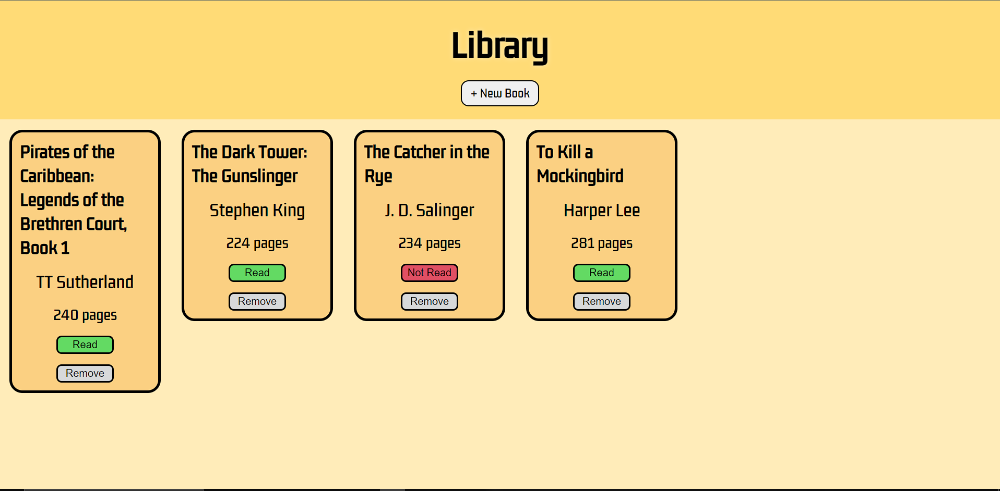

# Library
→ [Live Demo](https://rukhan4.github.io/library/)

## Table of contents
* [Description](#description)
* [Technologies](#technologies)
* [Setup](#setup)
* [Live Example](#live)

## Description
This project entails a library app that stores books entered by the user

### Features: 

1) Retrieves data from local storage so that each user's info can be saved
2) Full control over information added to the form as well as if it was read or not
3) Uses DOM Manipulation to update the library list accordingly


## Technologies
Project is created with:
* Javascript 1.7 (chrome)
* HTML5
* CSS3  
	
## Setup
To run this project, install it locally as shown:

Click the ``fork`` button in this repository. This allows the user to create a remote repository in their Github. In order to modify this project:

1) Copy the Git repository URL for your new Fork

2) On the terminal, in your project directory, add a remote:

``git remote add fork <repo-fork-url>``

3) Ensure your fork is up-to-date in relation to the original project

```git checkout master```

```git pull -rebase origin master```

4) Remove the existing upstream for master; Setup upstream to publish your commits to your Fork

```git branch --unset-upstream master```

```git push -u fork master```

## Live

